<!---
 * File Name: readme.md
 * @author Team I (For Job Seeker System project, ITO5136 Software Engineering TP6-2022, Monash University)
 * Last Modified On: 2022-DEC-2
 * Description: This is a read me file where installation and project description instructions are included to aid users.
-->

# Read Me - Job Seeker System

### 1. About

Team I, including; Bastien Goepfert,Evaggelos Goulas, Roshanak Ettehadi and Simon Lus were commissioned by Monash Job Seeking Centre (MonJS) to develop a job seeking system (JSS).
 JSS will be used to enhance job searching results for both job-seekers and recruiters.
 
 
Features:
- Register for Job Seekers' and Recruiters' users  
- Login / logout functionality for all types of registered users (Job Seekers and Recruiters)  
- Job Seeker profile management  
- Recruiter profile management  
- Job advertisement creation and management by Recruiter profiles.  
- Applying for advertised jobs by Job Seeker profiles.  
- Matching management  

### 2. Installation guidelines

1. Press the Clone button and use your preferred method of cloning:
   git clone https://git.infotech.monash.edu/ito5136/ito5136-tp6-2022/group-i.git
   2. The project has been developed in IntelliJ, as such please run in IntelliJ if building via IDE.

2. Right click the pom.xml file, select the option "Maven", then in the Maven menu, select the "Download sources" option.

3. Build the project with Maven by right click on pom.xml file and un der the "Maven" menu, select the "Generate sources and update folders".
  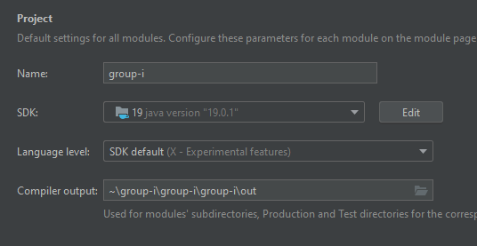
 
4. Build the project with Maven by right click on pom.xml file and un der the "Maven" menu, select the "Reload Project".
5. Right-click on the Main file and run main().

#### 2.1. Requirements
- Java version 19.0.1
- SDK 19.0.1
- Libraries as shown in the image below:
  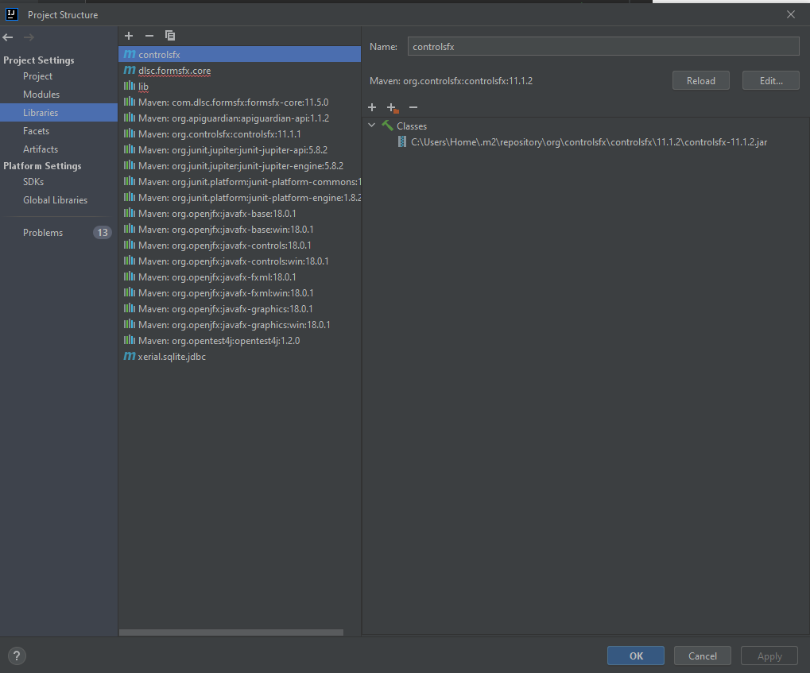
  [Libraries]

#### 2.2. Technology Stack
- Java
- SQLite
- JavaFX Scene Builder

### 3. How to use the system 
This is user-friendly application in which users can register or log in as a job-seeker or recruiter.

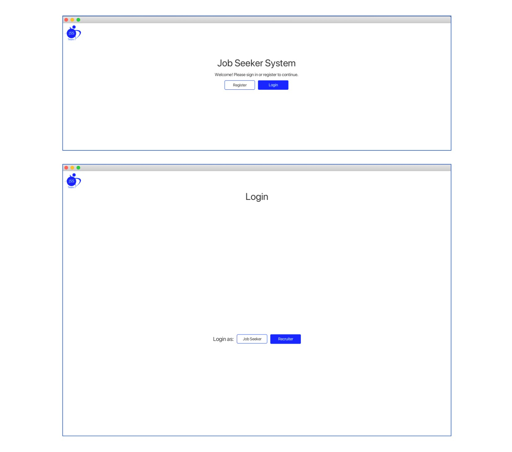
[Homepage and Login]

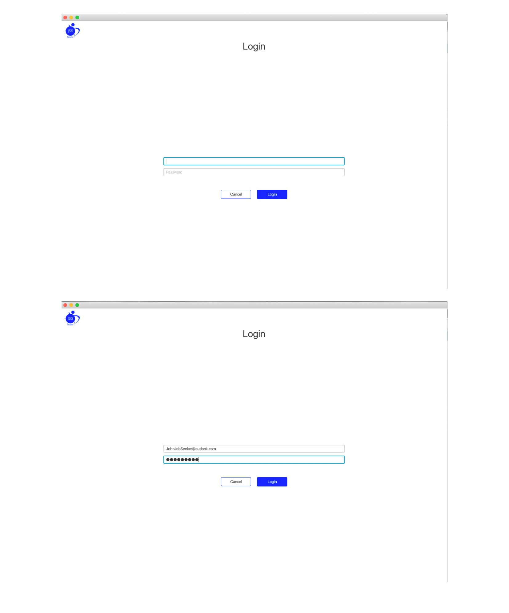
[Login] 

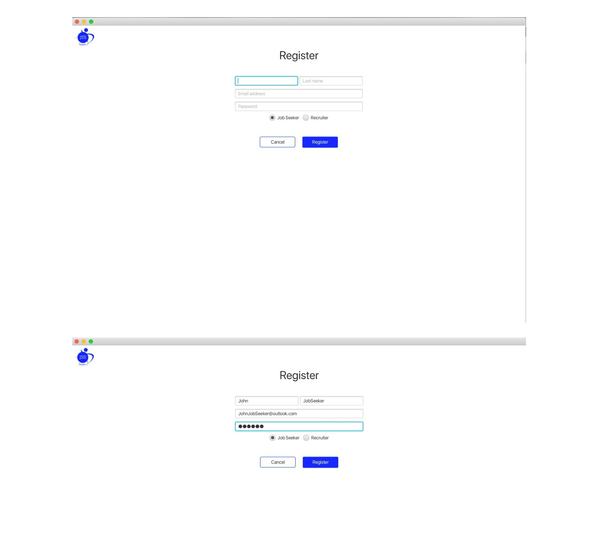
[Register]

#### 3.1. Job Seekers
System provides job seeker with ability to:
- Create and edit profile
- Search and view available jobs
- Apply for a job
- Get invited to apply for a job
- Accept or reject interview invitation

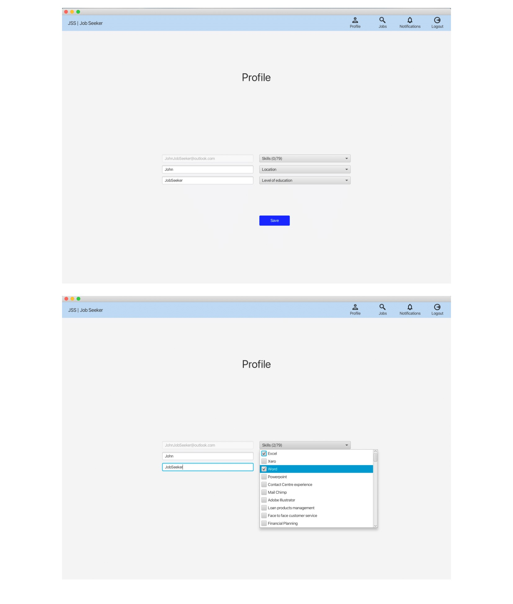
[Job Seeker Profile]
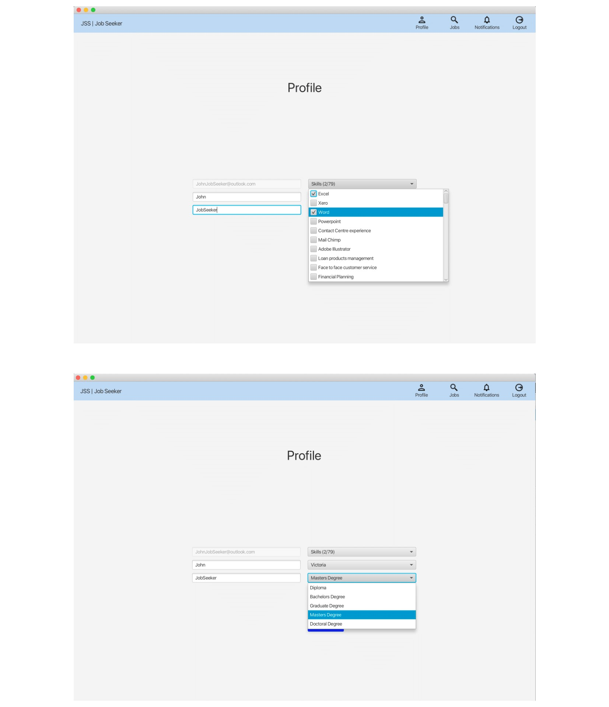
[Job Seeker Profile]
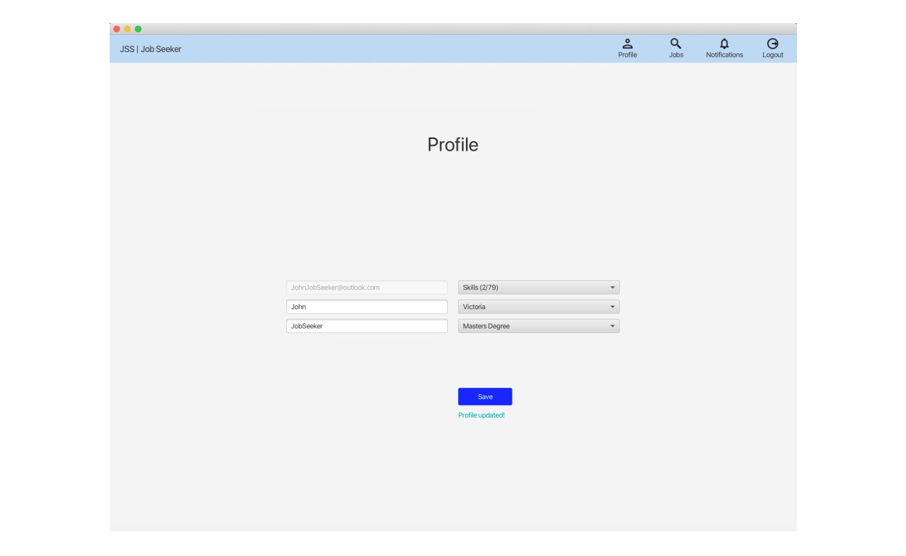
[Job Seeker Profile]

#### 3.2. Recruiters
System provides recruiter with ability to:
- Create a job (Advertising a new job)
- Viewing application (Viewing job applications)
- Finding Candidate Job (Finding the best candidate)
- Edit job (Modifying draft job)
Recruiter's user can create a profile for his company and search and view the available jobs,

### 4. Troubleshooting
- When you are running the project and received the below error:
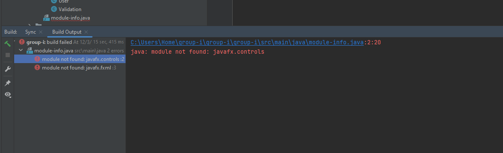
Right-Click on the pom.xml file, go to Maven and then choose "Reload project" as shown in the below image, then run the project again.

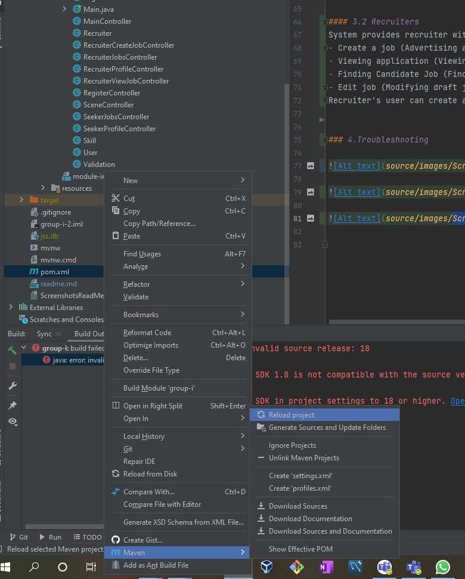

- If you got an error regarding the source version like below:

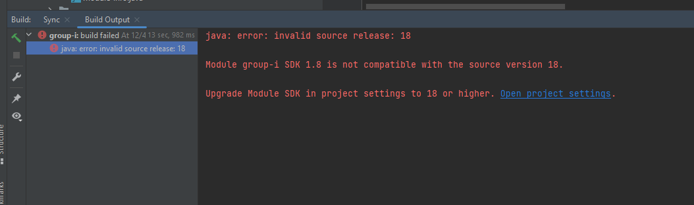

You should go the Project Structure and make sure your SDKs version and language level are all set according to the project version which in this case is 18 and above. Please Follow the instruction as shown in the images below:
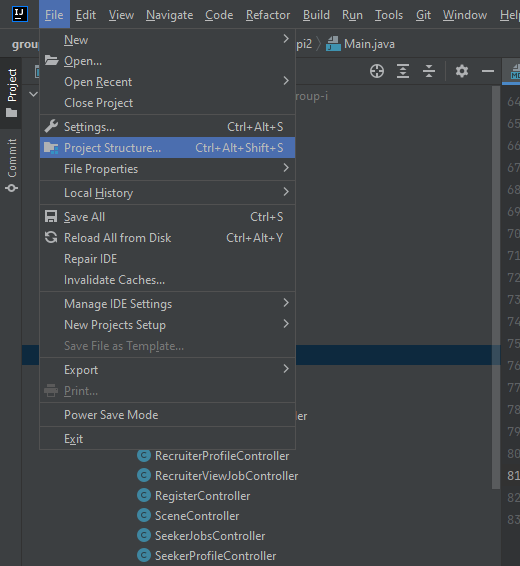
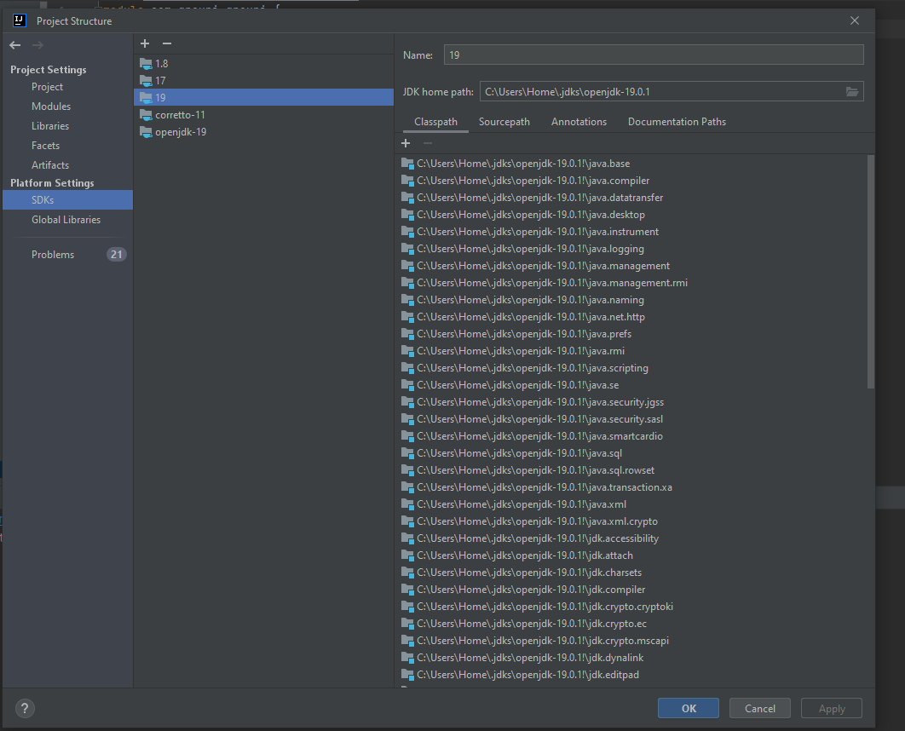
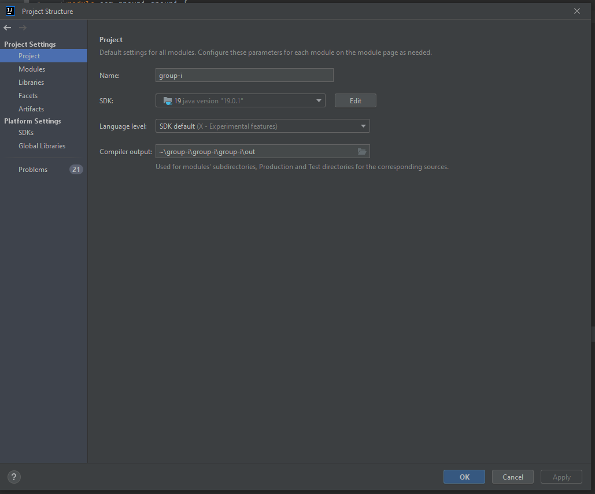